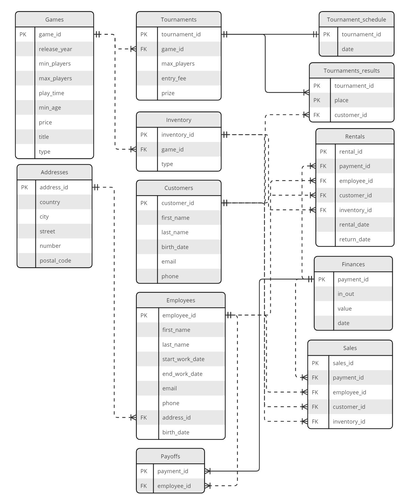

```{r setup, include=FALSE}
knitr::opts_chunk$set(echo = TRUE)
```

# Spis użytych technologii

Do stworzenia projektu zostały użyte następujące technologie:

  1. Tworzenie bazy danych:
      * Python z bibliotekami:
        - pandas,
        - numpy,
        - random,
        - datetime,
        - urllib.parse,
        - sqlalchemy,
        - itertools,
        - faker,
      * MariaDB,
    
  2. Analiza danych:
      * R z bibliotekami:
        - RMariaDB,
        - ggplot2, 
        - dplyr, 
        - dbplyr, 
        - tidyr, 
        - kableExtra,
        - emojifont, 
        - stringr,
        - colorspace,
        - wesanderson.
      
  3. Raport i dokumentacja:
      * Rmarkdown
    
  4. Tworzenie schematu baz danych:
     * Miro
  
# Lista plików i opis ich zawartości

W folderze **bazy_danych** znajdują się pliki tworzące cały projekt. Struktura zawartości folderu wygląda następująco 


<!-- dokończyć - sprawdzić przed wysłaniem żeby było zgodne z tym co faktycznie wyślemy -->
\dirtree{%
.1 bazy$\_$danych.
.2 data.
.3 address.csv.
.3 english$\_$first$\_$name.csv.
.3 english$\_$last$\_$name.csv.
.3 games.csv.
.3 polish$\_$female$\_$last$\_$name.csv.
.3 polish$\_$female$\_$name.csv.
.3 polish$\_$male$\_$last$\_$name.csv.
.3 polish$\_$female$\_$name.csv.
.2 dokumentacja.pdf.
.2 Raport.
.3 raport.Rmd.
.3 raport.pdf.
.2 scr.
.3 $\_\_$init$\_\_$.py.
.3 create.sql.
.3 generate.py.
.2 main.py.
}

W folderze $data$ znajdują się pliki $.csv$, których użyliśmy do generowania adresów,imion, nazwisk zarówno klientów sklepu jak i też samych pracowników. Użyliśmy również ich do generowania gier, które można wypożyczyć albo kupić.Źródła danych:

  - $address.csv$ - https://bip.um.wroc.pl/artykul/389/50007/aktualne-wykazy-nazw-ulic-i-adresow
  - $english\_first\_name.csv$ - https://catalog.data.gov/dataset/popular-baby-names/resource/02e8f55e-2157-4cb2-961a-2aabb75cbc8b
  - $english\_last\_name.csv$ - https://www.census.gov/topics/population/genealogy/data/2010_surnames.html
  - $games.csv$ - https://www.kaggle.com/datasets/andrewmvd/board-games
  - $polish\_female\_last_name.csv$ oraz $polis\_male\_last\_name.csv$- https://dane.gov.pl/pl/dataset/1681,nazwiska-osob-zyjacych-wystepujace-w-rejestrze-pesel
  - $polish\_female\_name.csv$ oraz $polish\_female\_name.csv$ - https://dane.gov.pl/pl/dataset/219,imiona-nadawane-dzieciom-w-polsce

Plik $dokumentacja.pdf$ jest plikiem zawierającym dokumentacje.

W folderze $Raport$ znajdują się plik do generowania raportu oraz plik z gotowym już raportem.

Kolejnym folderem jest $scr$. W środku znajdują się pliki, które służą do generowania i tworzenia bazy danych. Plik $\_\_init\_\_.py$, potrzebny jest do możliwości importowania pythonowych funkcji z innych plików znajdujących się w tym samym folderze. Plik $create.sql$ tworzy nam tabele do bazy danych. Plik $generate.py$ zawiera funkcje, przy pomocy których generujemy dane do wypełnienia stworzonej wcześniej bazę danych.

Plik $main.py$ służy do wgrania tabel z danymi na serwer.

<!-- jak dojdzie coś później, to trzeba zupdatować -->


# Kolejność i sposób uruchamiania plików, aby uzyskać gotowy projekt
    1. Posiadaj Pythona 3.8.8 (SPRAWDZIĆ)
    2. Zainstaluj potrzebne pakiety komendą: `pip install -r requirements.txt`
    3. Uruchom program main.py: `python main.py`
    4. 

# Schemat bazy danych i zależności funkcyjne w tabelach

<!-- \begin{figure}[H] -->
<!--     \centering -->
<!--     \includegraphics[scale=0.7]{assets/schemat_bazy_danych.pdf} -->
<!--     \caption{Schemt bazy danych} -->
<!-- \end{figure} -->

<!-- \begin{figure}[H] -->
<!--     \centering -->
<!--     \includegraphics[scale=0.7]{C:/Users/mkarc/studia/bazy danych/bazy_danych/schemat_obraz.jpg} -->
<!--     \caption{Schemt bazy danych} -->
<!-- \end{figure} -->





Klucze główne zaznaczamy przez pogrubienie.

## Tabela Customers
R(**customer_id**, first_name, last_name, birth_date, email, phone)
 
- customer_id [SMALLINT UNSIGNED] : numer  identyfikacyjny klienta
- first_name [VARCHAR(45)]: imię klienta
- last_name [VARCHAR(50)]: nazwisko klienta
- birth_date [DATE]: data urodzenia klienta
- email [VARCHAR(50)]: email klienta
- phone [VARCHAR(12)]: numer telefonu klienta
    
\begin{multline*}
\Sigma = \{ \text{customer\_id} \to \text{first\_name}, \text{customer\_id} \to  \text{last\_name}, \text{customer\_id} \to \text{birth\_date}, \\ \text{customer\_id} \to \text{email}, \text{email} \to \text{customer\_id},\text{customer\_id} \to \text{phone}, \text{phone} \to \text{customer\_id}   \} 
\end{multline*}

Informacje o dokładnym kliencie możemy pozyskać przez customer_id. Dokładną identyfikację klienta zapewnia także jego email lub jego numer telefonu,ponieważ zakładamy, że każdy ma jeden unikalny numer telefony oraz adres email.
    

## Tabela Employees
R(**employee_id**, first_name, last_name,start_work_date,end_work_date, email, phone, address_id)

- employee_id [SMALLINT UNSIGNED]: numer identyfikacyjny pracownika
- first_name [VARCHAR(45)]: imię pracownika
- last_name [VARCHAR(50)]: nazwisko pracownika
- start_work_date [DATE]: data zatrudnienia (rozpoczęcie pracy)
- end_work_date [DATE]: data zakończenia pracy
- email [VARCHAR(50)]: adres email pracownika
- phone [VARCHAR(12)]: numer telefonu pracownika
- address_id [SMALLINT UNSIGNED] (klucz obcy odwołujący się do tabeli Addresses : numer identyfikacyjny adresu.

\begin{multline*}
\Sigma = \{ \text{employee\_id} \to \text{first\_name}, \text{employee\_id} \to  \text{last\_name}, \text{employee\_id} \to \text{start\_work\_date},\\ \text{employee\_id} \to \text{start\_work\_date},\text{employee\_id} \to \text{email}, \text{email} \to \text{employee\_id}, \text{employee\_id} \to \text{phone}, \text{phone} \to \text{employee\_id} , \text{employee\_id} \to \text{address\_id}    \} 
\end{multline*}

Pracownik jest jednoznaczne zdefiniowany przez employee_id. Tak jak w przypadku klientów, pracownika też możemy rozpoznać po jego numerze telefonu lub email.
    
## Tabela Addresses
R(**address_id**, country, city, street,number,postal_code)

- address_id [SMALLINT UNSIGNED]: numer identyfikacyjny adresu.
- country [VARCHAR(50)]: państwo
- city [VARCHAR(50)]: miasto
- street [VARCHAR(50)]: ulica
- number [VARCHAR(10)]: numer budynku
- postal_code [VARCHAR(10)]: kod pocztowy.

\begin{multline*}
\Sigma = \{\text{adress\_id} \to \text{country}, \text{adress\_id} \to \text{city},\text{adress\_id} \to \text{street},\text{adress\_id} \to \text{number}, \\ \text{adress\_id} \to \text{postal\_code}, \text{country} + \text{city} +\text{street} +\text{number} + \text{postal\_code} \to \text{adress\_id} \}
\end{multline*}
    Adres jest dokładnie, jednoznacznie wyznaczony dla danego adress_id. Pozostałe pola tylko razem wskażą nam dokładny adres. 
    
## Tabela Games:
R(**game_id**,title, release_year,min_players,max_players,play_time,min_age,type,price)
    
- game_id [SMALLINT UNSIGNED]: numer identyfikacyjny gry
- title [VARCHAR(100)]: oryginalny tytuł gry
- release_year [DATE]: rok wydania gry
- min_players [TINYINT UNSIGNED]: minimalna liczba graczy
- max_players [TINYINT UNSIGNED]: maksymalna liczba graczy
- play_time [SMALLINT UNSIGNED]: szacowany czas gry w minutach
- min_age [TINYINT UNSIGNED]: wiek minimalny do zagrania w grę
- type [VARCHAR(18)]:  typ gry tzn czy jest to gr czy rozszerzenie do gry 
- price [DECIMAL]: cena za kupno gry

\begin{multline*}
\Sigma = \{ \text{game\_id} \to \text{title}, \text{game\_id} \to \text{release\_year},\text{game\_id} \to \text{min\_players},\text{game\_id} \to \text{max\_players}, \\ \text{game\_id} \to \text{play\_time}, \text{game\_id} \to \text{min\_age}, \text{game\_id} \to \text{type} ,\text{game\_id} \to \text{price} \}
\end{multline*}

  Gra jest wyznaczona jednoznacznie przez game_id. Połączenie wszystkich pozostałych informacji nie musi nam jednoznacznie określić gry ( Tytuły nie muszą być unikatowe)


## Tabela Inventory
R(**inventory_id**, game_id,type)

- inventory_id [SMALLINT UNSIGNED]: numer identyfikacyjny inwentarza
- game_id [SMALLINT UNSIGNED] (klucz obcy odwołujący się do tabeli Games): numer identyfikacyjny grę
- type [CHAR(1)]: przeznaczenie gry na magazynie ( czy na sprzedaż, czy na wypożyczenie, czy na turniej)

    $$ \Sigma = \left\{ \text{inventory\_id} \to \text{game\_id} , \text{inventory\_id} \to \text{type} \right\} $$

Gra w magazynie jest wyznaczona jednoznacznie przez inventory_id. Reszta informacji nie pozwala nam tego określić ponieważ możemy mieć kilka takich samych tytułów o takim samym przeznaczeniu.
    
## Tabela Tournaments
R(**tournament_id**, game_id,max_players,entry_fee,prize)

- tournament_id [SMALLINT UNSIGNED]: numer identyfikacyjny turnieju
- game_id [SMALLINT UNSIGNED] (klucz obcy odwołujący się do tabeli Games): numer identyfikacyjny grę w jaką się gra na turnieju
- max_players [TINYINT UNSIGNED]: maksymalna liczba graczy na turnieju
- entry_fee [DECIMAL]: wpisowe
- prize [DECIMAL]: nagroda za turniej zamiast 

\begin{multline*}
\Sigma = \{ \text{tournament\_id} \to \text{game\_id}, \text{tournament\_id} \to \text{max\_players}, \\ \text{tournament\_id} \to \text{entry\_fee}, \text{tournament\_id} \to \text{prize} \}
\end{multline*}

Turniej jest jednoznacznie wyznaczony jedynie przez tournament_id. Zakładamy, że nagroda nie jest bezpośrednio zależna iod wpisowego i liczby graczy.

## Tabela Tournament_schedule
R(**tournament_id**, date)

- tournament_id [SMALLINT UNSIGNED] (klucz obcy odwołujący się do tabeli Tournaments): numer identyfikacyjny turnieju
- date [DATE]: data turnieju

$$ \Sigma = \left\{ \text{tournament\_id} \to \text{date} \right\} $$

Tabela łącząca turniej z jego datą. W jeden dzień może odbywać się więcej niż 1 turniej

## Tabela Tournaments_results
R(**tournament_id, place**, customer_id)

- tournament_id [SMALLINT UNSIGNED] (klucz obcy odwołujący się do tabeli Tournaments): numer identyfikacyjny turnieju
- place [SMALLINT UNSIGNED]: miejsce zajęte w turnieju przez gracza (klienta)
- customer_id [SMALLINT UNSIGNED] (klucz obcy odwołujący się do tabeli Customers): numer identyfikacyjny klienta

$$ \Sigma = \left\{ \text{tournament\_id} + \text{place} \to \text{client\_id} \right\} $$

Identyfikator turnieju  w połączeniu z miejscem wyznacza nam jednoznacznie osobę, która te miejsce zajęła w turnieju. Zakładamy, że w turniejach nie ma miejsc ex aequo.

## Tabela Finances
R(**payment_id** , in_out, value, date)

- payment_id [MEDIUMINT UNSIGNED]: numer identyfikacyjny płatności
- in_out [TINYINT]: czy jest to płatność czy przychód
- value [DECIMAL]: wartość płatności
- date [DATE]: data płatności

$$ \Sigma = \left\{ \text{payment\_id} \to \text{in\_out}, \text{payment\_id} \to \text{value},\text{payment\_id} \to \text{date} \right\} $$

Tylko payment id wyznacza nam jednoznacznie przepływ pieniężny.

## Tabela Payoffs: R(**payment_id**, employee_id)

- payment_id [MEDIUMINT UNSIGNED] (klucz obcy odwołujący się do tabeli Finances): numer identyfikacyjny płatności  
- employee_id [SMALLINT UNSIGNED] (klucz obcy odwołujący się do tabeli Employees): numer identyfikacyjny pracownika

$$ \Sigma = \left\{ \text{payment\_id} \to \text{employee\_id}  \right\} $$
    
Każda wypłata jest jednoznacznie zdefinowana przez payment_id i ma przypisanego pracownika. Relacją w drugą stronę nie zachodzi ponieważ pracownik może mieć kilka wypłat. 

## Tabela Rentals
R(**rental_id**,payment_id,employee_id, customer_id,inventory_id,rental_date,return_date)

- rental_id [SMALLINT UNSIGNED]: numer identyfikacyjny wypożyczenia
- payment_id [MEDIUMINT UNSIGNED] (klucz obcy odwołujący się do tabeli Finances) : numer identyfikacyjny płatności
- employee_id [SMALLINT UNSIGNED] (klucz obcy odwołujący się do tabeli Employees): numer identyfikacyjny pracownika
- customer_id [SMALLINT UNSIGNED] (klucz obcy odwołujący się do tabeli Customers): numer identyfikacyjny klienta
- inventory_id [SMALLINT UNSIGNED] (klucz obcy odwołujący się do tabeli Inventory): numer identyfikacyjny inwentarza
- rental_date [DATE]: data wypożyczenia gry
- return_date [DATE]: data oddania gry


\begin{multline*}
\Sigma = \{\text{rental\_id} \to \text{payment\_id}, \text{rental\_id} \to \text{employee\_id},\text{rental\_id} \to \text{customer\_id},\text{rental\_id} \to \text{inventory\_id}, \\ \text{rental\_id} \to \text{rental\_date},\text{rental\_id} \to \text{return\_date}, \text{payment\_id} \to \text{rental\_id} \}
\end{multline*}

Wypożyczenie jest jednoznacznie wyznaczone przez rental_id, tak jak payment id. Pozostałe pola nie muszą jednoznacznie wyznaczyć wypożyczenia.

## Tabela Sales
R(**sales_id**,payment_id,employee_id, customer_id,inventory_id)

- sales_id [SMALLINT UNSIGNED]: numer identyfikacyjny sprzedaży gry 
- payment_id [MEDIUMINT UNSIGNED] (klucz obcy odwołujący się do tabeli Finances) : numer identyfikacyjny płatności
- employee_id [SMALLINT UNSIGNED] (klucz obcy odwołujący się do tabeli Employees): numer identyfikacyjny pracownika
- customer_id [SMALLINT UNSIGNED] (klucz obcy odwołujący się do tabeli Customers): numer identyfikacyjny klienta
- inventory_id [SMALLINT UNSIGNED] (klucz obcy odwołujący się do tabeli Inventory): numer identyfikacyjny inwentarza

\begin{multline*}    
 \Sigma = \{ \text{sales\_id} \to \text{payment\_id}, \text{sales\_id} \to \text{employee\_id},\text{sales\_id} \to \text{customer\_id},\\ \text{sales\_id} \to \text{game\_id} ,  \text{payment\_id} \to \text{sales\_id}  \} 
 \end{multline*}

Każda sprzedaż ma unikatowy sales_id. Transakcja sprzedaży może być też jednoznacznie wyznaczona przez payment_id.

# Postać normalna bazy danych

Jak możemy zauważyć w naszej bazie danych w każdej tabeli wszystkie nietrywialne relację zaczynają się od nadklucza wię spełnia postać BCNF z czego wynika także że spełnia postać normalną EKNF.

# Co było najtrudniejsze w projekcie?

Największym wyzwaniem w projekcie było poprawne wygenerowanie danych i wrzucenie ich na serwer. Wyzwaniem było także zrozumienie i zaprojektowanie bazy danych w ten sposób był spełniała postać normalną EKNF.
